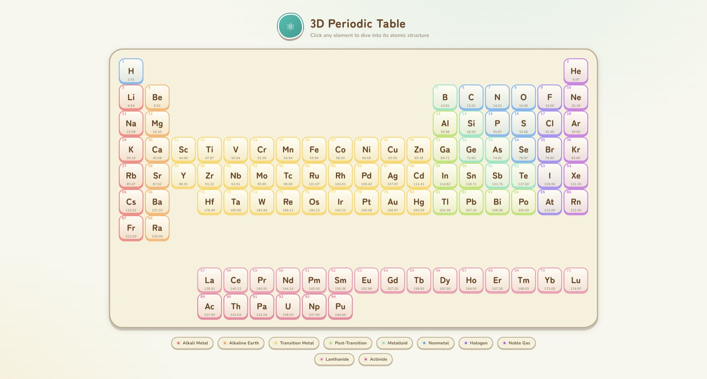
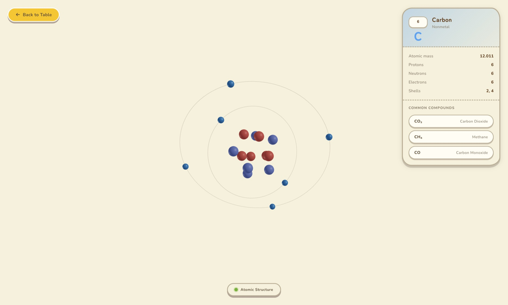
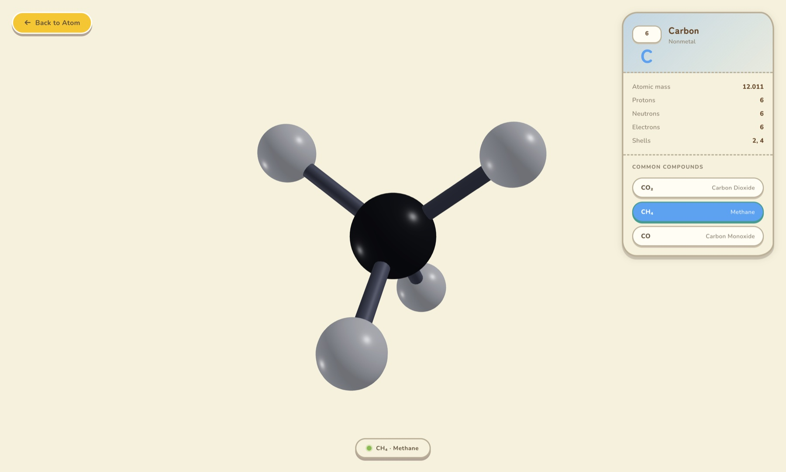

# 3D Periodic Table

**Live demo →** <https://3d-periodic-table-liart.vercel.app>

Interactive 3D periodic table built with **Vite + Vue 3 + [TresJS](https://tresjs.org/)**.
Click any element to scatter the table and dive into a Bohr-model atom; click a
compound to see its molecular structure as a ball-and-stick model.

- Interaction inspired by [@DilumSanjaya's element-explorer demo](https://x.com/DilumSanjaya/status/2061490330361589849).
- Visual style — warm parchment palette, organic shapes, and the *Nintendo button press* depth — inspired by [`animal-island-vue`](https://github.com/guokaigdg/animal-island-vue) (Animal Crossing-style Vue UI kit).

---

## Periodic Table

The entry view — 94 elements colored by category, with hover tooltips, a clean
light theme, and a radial-scatter transition when an element is selected.



## Atomic Structure

A Bohr-model atom: red protons + blue neutrons packed into a nucleus, with
electrons orbiting along 3D-tilted shells. The HUD shows atomic data and a list
of common compounds for that element.



## Compound / Molecule

Ball-and-stick rendering with CPK-style colors and per-bond cylinders (double
and triple bonds are drawn as parallel cylinders).



---

## Run locally

```bash
npm install
npm run dev
```

Then open <http://localhost:5173/>.

## Tech

- **Vite** + **Vue 3** (`<script setup>`)
- **TresJS** (`@tresjs/core`, `@tresjs/cientos`) for declarative Three.js
- **three.js** for 3D math / renderer
- Pure-CSS scatter animation for the table → atom transition
- Animal Crossing-inspired design system: warm parchment background, pill / organic-blob radii, 3D press shadows, mint teal + yellow focus accents, Nunito + Zen Maru Gothic via `@fontsource`

## Project layout

```
src/
  App.vue                       # view orchestration + HUD overlay
  components/
    PeriodicTable.vue           # CSS-animated table grid
    AtomScene.vue               # TresCanvas for atom
    MoleculeScene.vue           # TresCanvas for compounds
    atom/
      Nucleus.vue               # nucleon packing
      ElectronShell.vue         # orbit ring + animated electrons
  data/
    elements.js                 # element table + shells + categories
    compounds.js                # atom positions + bond lists
```
